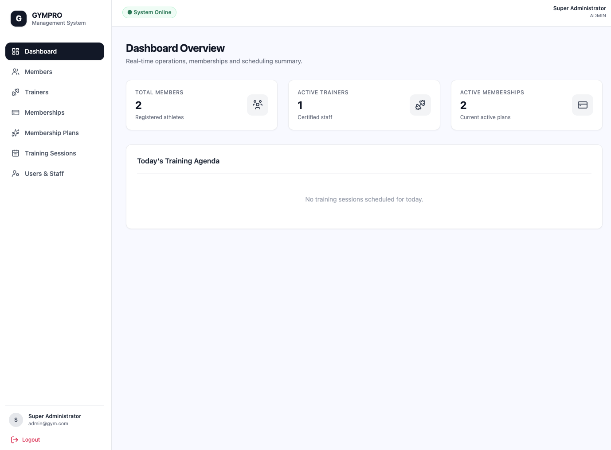
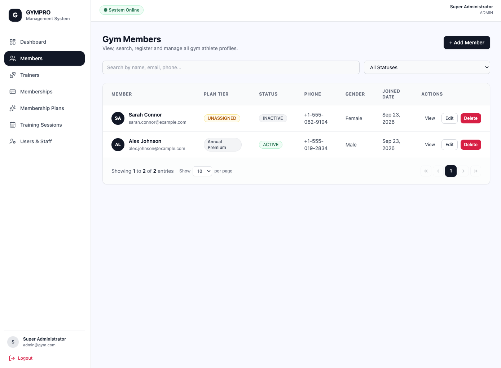
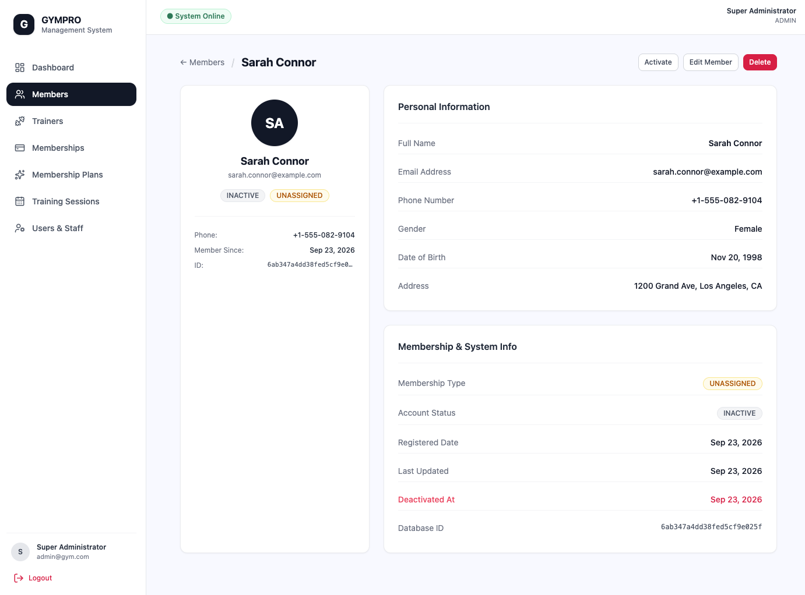
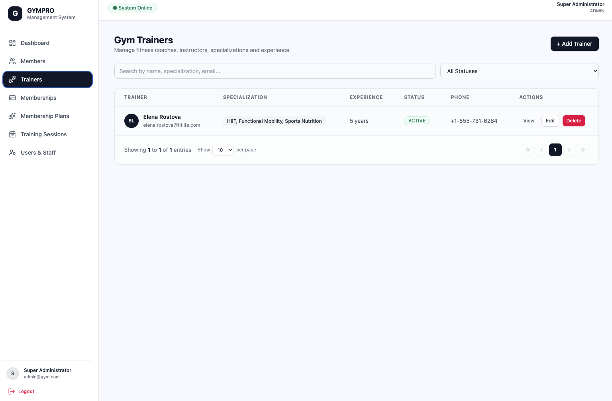
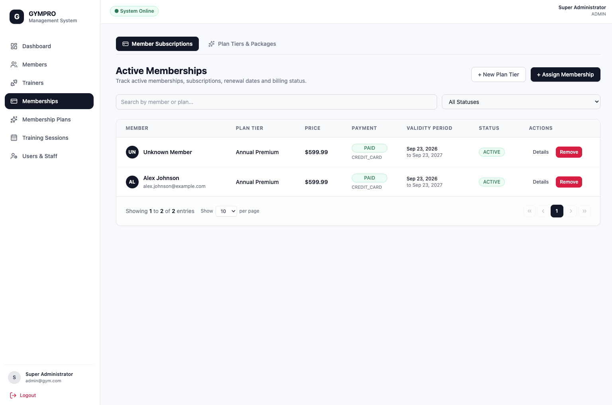
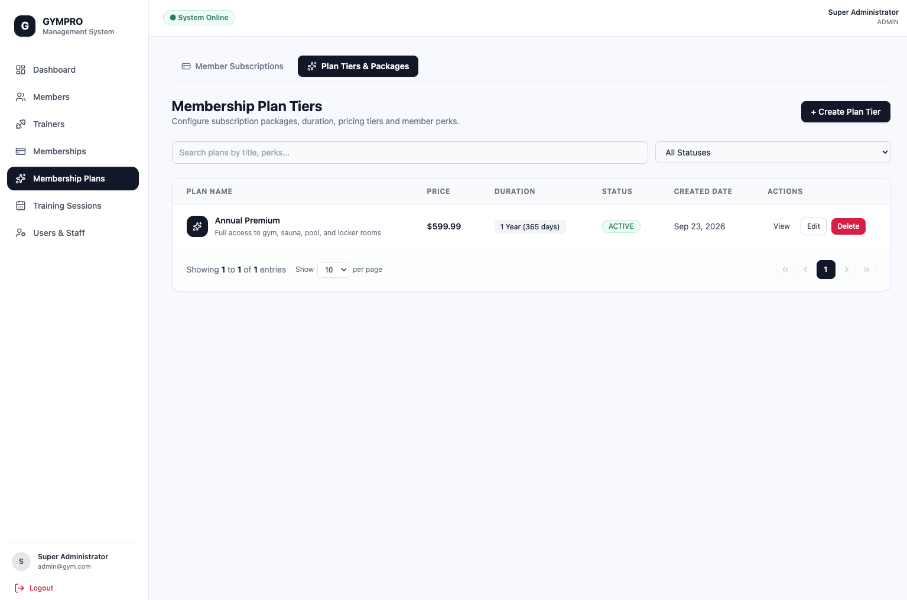
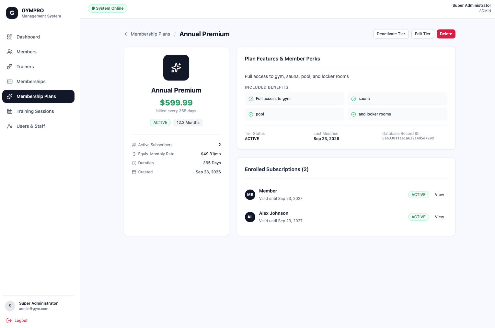
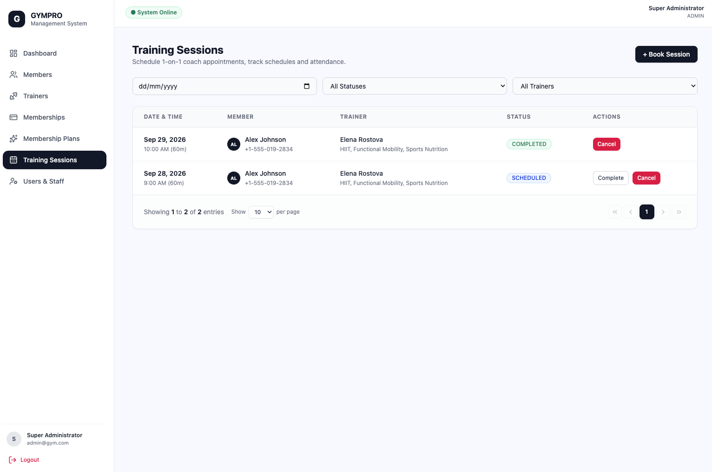
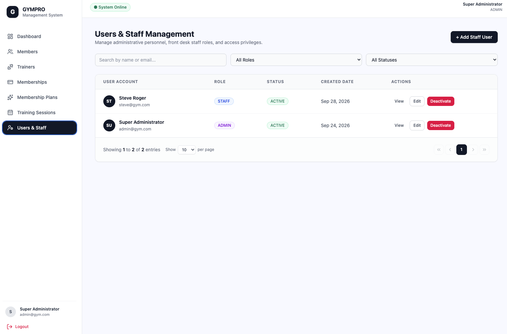

# 🏋️ GYMPRO - Management System

**GYMPRO** is a full-stack, gym management web application built with **React 19**, **Next.js 16**, **Tailwind CSS v4**, and **MongoDB**. Designed for fitness centers, gym administrators, and staff to streamline daily operations, member onboarding, trainer scheduling, membership subscriptions, and role-based administrative control.

**Contributers:**

1. Sai Pone Kha Aung
2. Nang Mwe Kham

---

## 📑 Table of Contents

- [Features](#-features)
- [Tech Stack](#-tech-stack)
- [System Architecture](#-system-architecture)
  - [Architectural Diagram](#architectural-diagram)
  - [Core Architectural Layers](#core-architectural-layers)
  - [Request Lifecycle & Data Flow](#request-lifecycle--data-flow)
  - [Security & RBAC Architecture](#security--rbac-architecture)
- [Directory Structure](#-directory-structure)
- [Getting Started](#-getting-started)
  - [Prerequisites](#prerequisites)
  - [1. Clone Repository](#1-clone-repository)
  - [2. Backend Configuration & Setup](#2-backend-configuration--setup)
  - [3. Frontend Configuration & Setup](#3-frontend-configuration--setup)
- [Initial Admin Account Setup](#-initial-admin-account-setup)
- [Environment Variables Reference](#-environment-variables-reference)
- [API Endpoints Reference](#-api-endpoints-reference)
- [Role-Based Access Control (RBAC)](#-role-based-access-control-rbac)
- [Available Scripts](#-available-scripts)
- [License](#-license)

---

## ✨ Features

### 📊 Interactive Dashboard

- **Operational KPIs**: Quick insight into total members, active trainers, and active membership subscriptions.
- **Today's Agenda**: Real-time list of training sessions scheduled for the day, displaying member, assigned trainer, timing, and session status.

### 👤 Member Management

- Full member directory with search, filter, and pagination.
- Create, view, edit, and archive gym member records.
- Track member profile information (gender, date of birth, contact details, address).
- Comprehensive member details page showing subscription history and personal training records.

### 📋 Membership Plans & Subscriptions

- **Configurable Plans**: Define plans with custom durations (in days), pricing, and feature descriptions.
- **Subscription Tracking**: Associate members with plans, automatically tracking start and expiration dates.
- **Payment Processing**: Record payment methods (`CASH`, `CREDIT_CARD`, `DEBIT_CARD`, `BANK_TRANSFER`, `QR_CODE`) and status (`PENDING`, `PAID`, `FAILED`, `REFUNDED`).

### 🏃 Personal Trainers & Sessions

- **Trainer Profiles**: Manage fitness staff records including contact details, specializations (e.g., Strength, HIIT, Nutrition), experience level, and work shifts.
- **Session Scheduling**: Book 1-on-1 personal training sessions between members and trainers with start times, duration, and status updates (`SCHEDULED`, `COMPLETED`, `CANCELLED`).

### 🔐 Authentication & Admin Management

- **Secure Authentication**: JWT-based authentication using cookies and Bearer tokens with encrypted password hashing (`bcrypt`).
- **Role-Based Access Control (RBAC)**: Distinct permissions for `ADMIN` and `STAFF`.
- **User Management**: Admins can invite and manage staff accounts, toggle account statuses (`ACTIVE` / `INACTIVE`), and assign roles.
- **Password Recovery**: Integrated forgot password and reset token flow.

---

## 📷 Screenshot

Image files are located in the [docs](docs/) folder.












---

## 🛠 Tech Stack

### Frontend

- **Framework**: [React 19](https://react.dev/) + [Vite 8](https://vite.dev/)
- **Routing**: [React Router v7](https://reactrouter.com/)
- **Styling**: [Tailwind CSS v4](https://tailwindcss.com/)
- **Icons**: [Lucide React](https://lucide.dev/)
- **State & Context**: React Context API (`AuthContext`, `ToastContext`)

### Backend

- **Framework**: [Next.js 16](https://nextjs.org/) (App Router API routes & proxy middleware)
- **Database**: [MongoDB](https://www.mongodb.com/) (Native MongoDB Driver v7)
- **Authentication**: [jsonwebtoken](https://github.com/auth0/node-jsonwebtoken) & [bcrypt](https://github.com/kelektiv/node.bcrypt.js)
- **CORS Handling**: Dynamic origin configuration via `proxy.js`

### Deployment & DevOps

- **Cloud VPS**: [Microsoft Azure](https://portal.azure.com/) (Ubuntu 24.04 LTS)
- **Containerization**: [Docker](https://www.docker.com/) & [Docker Compose v2](https://docs.docker.com/compose/)
- **Reverse Proxy & Web Server**: [NGINX](https://nginx.org/)
- **Database Hosting**: [MongoDB Atlas](https://www.mongodb.com/atlas) (Cloud DB)

---

## 🏗 System Architecture

The Gym Management System is engineered as a decoupled, multi-tiered client-server architecture designed for high maintainability, responsive user experience, and defense-in-depth role-based access control.

### Architectural Diagram

```mermaid
flowchart TD
    subgraph ClientLayer ["🖥️ Frontend Presentation Layer (React 19 + Vite 8)"]
        UI["React 19 UI & Views<br/>(Tailwind CSS v4 + Lucide Icons)"]
        Router["React Router v7<br/>(ProtectedRoute Role Guards)"]
        StateContext["Application Contexts<br/>(AuthContext & ToastContext)"]
        APIClient["API Client Module (client.js)<br/>(JWT Injection & 401 Interception)"]

        UI --> Router
        Router --> StateContext
        StateContext --> APIClient
    end

    subgraph NetworkLayer ["🌐 Network & Gateway Layer"]
        DevProxy["Vite Dev Server Proxy<br/>(:5173/api ➔ :3000)"]
        CORS["CORS & Origin Validation<br/>(ALLOWED_ORIGINS)"]
    end

    subgraph BackendLayer ["⚙️ Backend Application Layer (Next.js 16 App Router)"]
        Middleware["Next.js Middleware Interceptor (proxy.js)<br/>• CORS Preflight (OPTIONS) Handling<br/>• Public Route Bypass (/api/auth/*)<br/>• Header Sanitization (Strip spoofed x-user)<br/>• JWT Authentication & User Claims Enrichment"]

        subgraph RouteHandlers ["Domain Route Handlers (src/app/api/*)"]
            AuthRoute["/api/auth (Login, Register, Password Reset)"]
            DashboardRoute["/api/dashboard (Metrics & Daily Agenda)"]
            MembersRoute["/api/members (CRUD, Search & Pagination)"]
            PlansRoute["/api/membership-plans (Plan Catalog)"]
            MembershipsRoute["/api/memberships (Subscriptions & Billing)"]
            TrainersRoute["/api/trainers (Profiles & Shift Management)"]
            SessionsRoute["/api/training-sessions (Booking & Status)"]
            UsersRoute["/api/users (Staff & Admin Accounts)"]
        end

        subgraph CoreLibs ["Core Infrastructure Services (src/lib/*)"]
            AuthLib["auth.js<br/>(JWT Signing, Verify & authorize())"]
            PaginationLib["pagination.js<br/>(Query Sanitization, Regex & Offsets)"]
            MongoLib["mongodb.js<br/>(MongoClient Singleton Connection Pool)"]
        end
    end

    subgraph DatabaseLayer ["🗄️ Persistence Layer (MongoDB)"]
        UsersCol[("users")]
        MembersCol[("members")]
        PlansCol[("membership_plans")]
        MembershipsCol[("memberships")]
        TrainersCol[("trainers")]
        SessionsCol[("training_sessions")]
    end

    %% Layer Interactions
    APIClient -->|"HTTP / JSON (Bearer Token / Cookie)"| DevProxy
    DevProxy -->|"Forward to http://localhost:3000"| Middleware
    CORS -.-> Middleware

    Middleware -->|"Sanitized & Enriched Request (x-user-*)"| RouteHandlers
    RouteHandlers <--> CoreLibs
    CoreLibs <--> DatabaseLayer
```



---

### Core Architectural Layers

1. **Frontend Presentation Layer (`frontend/`)**
   - **Framework & Tooling**: Built on **React 19** powered by **Vite 8** for fast HMR and optimized production bundles.
   - **Styling**: Utilizes **Tailwind CSS v4** with unified CSS variables and modern utility tokens.
   - **Route Guards**: Managed via **React Router v7** using `ProtectedRoute` wrappers that evaluate user roles (`ADMIN` vs. `STAFF`) before rendering sensitive views.
   - **Global State**: React Context (`AuthContext`, `ToastContext`) coordinates user session state, role validation, authentication persistence, and user notifications.
   - **Unified API Client (`client.js`)**: Centralized `fetch` wrapper automatically serializes payloads, attaches JWT Bearer tokens from `localStorage`, forwards cookies with `credentials: "include"`, and intercepts `401 Unauthorized` responses to flush stale sessions.

2. **Network & Gateway Layer**
   - **Development Reverse Proxy**: Vite's dev server intercepts `/api/*` calls from the browser on port `5173` and transparently proxies them to Next.js on port `3000`, eliminating local CORS friction.
   - **CORS Handling**: Next.js middleware inspects incoming `Origin` headers against the `ALLOWED_ORIGINS` configuration and returns compliant CORS preflight headers (`Access-Control-Allow-Origin`, `Access-Control-Allow-Credentials`, allowed HTTP verbs, and headers).

3. **Backend Application Layer (`backend/`)**
   - **Next.js 16 App Router**: Headless API server utilizing standalone Node.js runtime and route handlers for RESTful operations.
   - **Global Middleware Interceptor (`proxy.js`)**:
     - Runs before all `/api/:path*` route invocations.
     - Directly fulfills `OPTIONS` preflight requests.
     - Strips spoofed `x-user-id`, `x-user-email`, and `x-user-role` headers from public requests.
     - Validates cryptographic JWTs for protected routes and enriches downstream request headers with authenticated user identity.
   - **Domain Route Handlers (`src/app/api/`)**: Clean, resource-oriented endpoint modules with input validation, transaction handling, and structured HTTP error responses.
   - **Shared Libraries (`src/lib/`)**:
     - `auth.js`: Houses `signToken`, `verifyToken`, and `authorize(request, allowedRoles)` helper functions enforcing cryptographic token verification at the endpoint level.
     - `mongodb.js`: Implements a cached global `MongoClient` singleton connection pool to prevent socket exhaustion during Next.js server invocations and hot-reloading.
     - `pagination.js`: Universal helper for regular expression escaping, dynamic sorting, skip/limit calculations, and structured pagination metadata (`page`, `limit`, `totalPages`, `totalCount`).

4. **Persistence Layer (MongoDB)**
   - Document-oriented storage partitioned across six core collections:
     - `users`: Administrative and staff credentials, bcrypt-hashed passwords, role definitions (`ADMIN` | `STAFF`), and account statuses (`ACTIVE` | `INACTIVE`).
     - `members`: Member demographics, contact information, profile metadata, soft-deletion status (`isDeleted`), and current status (`ACTIVE` | `INACTIVE`).
     - `membership_plans`: Available membership tiers, duration in days, pricing, and allowed facilities/features.
     - `memberships`: Member subscription contracts, active/expiration date tracking, payment records (`CASH`, `CREDIT_CARD`, `DEBIT_CARD`, `BANK_TRANSFER`, `QR_CODE`), and statuses (`ACTIVE`, `EXPIRED`, `CANCELLED`).
     - `trainers`: Trainer profiles, contact details, specializations (e.g. Strength, HIIT, Yoga), experience levels, and working shift schedules.
     - `training_sessions`: 1-on-1 booked sessions linking members and trainers with start times, duration, notes, and session lifecycle statuses (`SCHEDULED`, `COMPLETED`, `CANCELLED`).

---

### Request Lifecycle & Data Flow

```text
[User Interaction] ➔ [React View / Component]
                             │
                             ▼
                    [API Client (client.js)]
                             │ (Injects Authorization: Bearer <token>)
                             ▼
                 [Vite Dev Proxy (:5173/api)]
                             │ (Forwards to http://localhost:3000)
                             ▼
            [Next.js Middleware Interceptor (proxy.js)]
                             │
            ┌────────────────┴────────────────┐
            ▼                                 ▼
   [Public Route (/api/auth/*)]      [Protected Route]
   • Strip spoofed headers           • Verify JWT (Bearer / Cookie)
   • Allow downstream                • Reject if invalid (401)
            │                        • Inject x-user-* identity headers
            └────────────────┬────────────────┘
                             ▼
              [Next.js Route Handler (/api/*)]
                             │
                             ├─► [authorize(request, allowedRoles)] ➔ 403 if forbidden
                             │
                             ├─► [paginationQuery() / Input Sanitization]
                             │
                             ▼
              [MongoDB Singleton (mongodb.js)]
                             │ (Connection pooling & query execution)
                             ▼
                  [MongoDB Database Engine]
                             │
                             ▼
             [JSON Response (HTTP 200/201/400/500)]
                             │
                             ▼
                 [Frontend UI Re-render & Toast]
```

---

### Security & RBAC Architecture

The system implements a multi-tier **Defense-in-Depth** security model:

1. **Client-Side Routing Guards**: `ProtectedRoute` checks user session credentials and prevents unauthorized route rendering in the browser.
2. **Gateway-Level Header Sanitization & Verification**: The `proxy.js` middleware rejects unauthenticated requests before they hit protected business logic and removes any malicious incoming `x-user-*` headers sent by the client.
3. **Endpoint-Level Cryptographic Authorization**: Handlers invoke `authorize(request, ['ADMIN'])` which re-verifies the cryptographic JWT signature directly against the server's `JWT_SECRET`, preventing client-side role privilege escalation.
4. **Credential Security**: Passwords are encrypted using salted `bcrypt` hashing, and JWT tokens carry configurable expiration windows.

---

## 📁 Directory Structure

```text
gym_management_system/
├── backend/
│   ├── package.json               # Backend dependencies & scripts
│   ├── proxy.js                   # Next.js request proxy & CORS / Auth interceptor
│   └── src/
│       ├── app/
│       │   └── api/               # Next.js App Router API endpoints
│       │       ├── auth/          # Login, Register, Logout, Password reset
│       │       ├── dashboard/     # Summary metrics & daily agenda
│       │       ├── members/       # Member CRUD routes
│       │       ├── membership-plans/ # Plan definitions
│       │       ├── memberships/   # Subscriptions & payment logs
│       │       ├── trainers/      # Trainer directory & profiles
│       │       ├── training-sessions/ # Session bookings & tracking
│       │       └── users/         # Admin user & staff management
│       ├── constants/             # Enums & mock payloads
│       └── lib/
│           ├── auth.js            # JWT signing, verification & RBAC authorization
│           ├── mongodb.js         # MongoDB connection client singleton
│           └── pagination.js      # Pagination helper utilities
│
├── frontend/
│   ├── index.html
│   ├── package.json               # Frontend dependencies & scripts
│   ├── vite.config.js             # Vite config & API reverse proxy
│   └── src/
│       ├── api/                   # Modular API client wrappers
│       ├── components/            # Reusable UI & feedback components (Modal, Button, Table, Toast)
│       ├── context/               # AuthContext & ToastContext providers
│       ├── hooks/                 # Custom React hooks (useAuth, useModal, useDebounce)
│       ├── layouts/               # Dashboard & Auth layouts, Navbar, Sidebar
│       ├── pages/                 # Application views (Dashboard, Members, Trainers, etc.)
│       ├── routes/                # Route definitions & ProtectedRoute guards
│       └── utils/                 # Formatters, date utilities, and constants
│
└── README.md                      # Project documentation
```

---

## 🚀 Getting Started

### Prerequisites

Ensure you have the following installed on your local machine:

- **Node.js**: v18.18.0 or newer (v20+ recommended)
- **npm**: v9+ (or `pnpm` / `yarn` / `bun`)
- **MongoDB**: A running local instance (`mongodb://localhost:27017`) or a [MongoDB Atlas](https://www.mongodb.com/atlas) cluster URI

---

### 1. Clone Repository

```bash
git clone https://github.com/Sai-Pone-Kha-Aung/gym_management_system.git
cd gym_management_system
```

---

### 2. Backend Configuration & Setup

1. **Navigate to the backend directory and install dependencies:**

   ```bash
   cd backend
   npm install
   ```

2. **Configure environment variables:**
   Create a `.env.local` file in the `backend/` directory:

   ```env
   # Database connection
   MONGODB_URI=mongodb://localhost:27017
   DB_NAME=gym_management

   # JWT Configuration
   JWT_SECRET=your_super_secret_jwt_key_here

   # Allowed CORS Origins (comma-separated)
   ALLOWED_ORIGINS=http://localhost:5173,http://localhost:3000
   ```

3. **Start the backend development server:**
   ```bash
   npm run dev
   ```
   The backend API will be available at **`http://localhost:3000`**.

---

### 3. Frontend Configuration & Setup

1. **Open a new terminal, navigate to the frontend directory, and install dependencies:**

   ```bash
   cd frontend
   npm install
   ```

2. **(Optional) Configure environment variables:**
   Create a `.env` file in `frontend/` if you wish to override defaults:

   ```env
   # Leave empty to use Vite's built-in dev proxy to localhost:3000
   VITE_API_URL=
   ```

3. **Start the frontend development server:**
   ```bash
   npm run dev
   ```
   The frontend application will run at **`http://localhost:5173`**.

---

## 👑 Initial Admin Account Setup

The system includes automatic first-admin bootstrapping:

1. When the database is newly initialized with **zero users**, the first account created via the registration endpoint is automatically granted the **`ADMIN`** role.
2. You can register the initial administrator by sending a request to `/api/auth/register` (e.g. using curl, Bruno, or Postman):

```bash
curl -X POST http://localhost:3000/api/auth/register \
  -H "Content-Type: application/json" \
  -d '{
    "name": "Admin User",
    "email": "admin@gym.com",
    "password": "password123",
    "role": "ADMIN"
  }'
```

3. Once created, open **`http://localhost:5173/login`** and sign in with your admin credentials.
4. From the application UI, you can now navigate to **Users** (`/users`) to create additional `ADMIN` or `STAFF` members.

---

## ⚙️ Environment Variables Reference

### Backend (`backend/.env.local`)

| Variable          | Required | Default                                       | Description                                                               |
| ----------------- | -------- | --------------------------------------------- | ------------------------------------------------------------------------- |
| `MONGODB_URI`     | **Yes**  | —                                             | MongoDB connection string (e.g. `mongodb://localhost:27017` or Atlas URL) |
| `DB_NAME`         | **Yes**  | `gym_management`                              | The database name inside your MongoDB instance                            |
| `JWT_SECRET`      | **Yes**  | `gym-default-secret-jwt-key-2026`             | Secret key used for signing & verifying JWT authentication tokens         |
| `ALLOWED_ORIGINS` | No       | `http://localhost:5173,http://localhost:3000` | Comma-separated list of origins allowed by CORS                           |
| `NODE_ENV`        | No       | `development`                                 | Node environment mode (`development` or `production`)                     |

### Frontend (`frontend/.env`)

| Variable       | Required | Default             | Description                                                            |
| -------------- | -------- | ------------------- | ---------------------------------------------------------------------- |
| `VITE_API_URL` | No       | `""` (Empty string) | Base URL for API requests. Default uses Vite dev server's `/api` proxy |

---

## 📡 API Endpoints Reference

All API routes are prefixed with `/api`. Protected routes require a valid JWT token via `Authorization: Bearer <token>` or HTTP cookie.

### Authentication (`/api/auth`)

| Method | Endpoint                    | Access        | Description                                    |
| ------ | --------------------------- | ------------- | ---------------------------------------------- |
| `POST` | `/api/auth/register`        | Public        | Register a user (initial user becomes `ADMIN`) |
| `POST` | `/api/auth/login`           | Public        | Authenticate user & issue JWT                  |
| `GET`  | `/api/auth/me`              | Authenticated | Retrieve current user profile                  |
| `POST` | `/api/auth/logout`          | Authenticated | Log out and clear session cookie               |
| `POST` | `/api/auth/forgot-password` | Public        | Request password reset token                   |
| `POST` | `/api/auth/reset-password`  | Public        | Reset password using valid reset token         |

### Dashboard (`/api/dashboard`)

| Method | Endpoint         | Access        | Description                                      |
| ------ | ---------------- | ------------- | ------------------------------------------------ |
| `GET`  | `/api/dashboard` | Staff / Admin | Get aggregated KPI statistics and today's agenda |

### Members (`/api/members`)

| Method   | Endpoint            | Access        | Description                                  |
| -------- | ------------------- | ------------- | -------------------------------------------- |
| `GET`    | `/api/members`      | Staff / Admin | List members with pagination & search        |
| `POST`   | `/api/members`      | Staff / Admin | Create a new member                          |
| `GET`    | `/api/members/[id]` | Staff / Admin | Get member profile, membership, and sessions |
| `PUT`    | `/api/members/[id]` | Staff / Admin | Update member details                        |
| `DELETE` | `/api/members/[id]` | Staff / Admin | Soft delete member                           |

### Membership Plans (`/api/membership-plans`)

| Method   | Endpoint                     | Access        | Description                  |
| -------- | ---------------------------- | ------------- | ---------------------------- |
| `GET`    | `/api/membership-plans`      | Staff / Admin | List all membership plans    |
| `POST`   | `/api/membership-plans`      | Staff / Admin | Create a new membership plan |
| `GET`    | `/api/membership-plans/[id]` | Staff / Admin | Get plan details             |
| `PUT`    | `/api/membership-plans/[id]` | Staff / Admin | Update plan details          |
| `DELETE` | `/api/membership-plans/[id]` | Staff / Admin | Delete plan                  |

### Memberships & Payments (`/api/memberships`)

| Method   | Endpoint                | Access        | Description                                |
| -------- | ----------------------- | ------------- | ------------------------------------------ |
| `GET`    | `/api/memberships`      | Staff / Admin | List all active/expired memberships        |
| `POST`   | `/api/memberships`      | Staff / Admin | Assign a plan to a member & record payment |
| `GET`    | `/api/memberships/[id]` | Staff / Admin | Get membership subscription details        |
| `PUT`    | `/api/memberships/[id]` | Staff / Admin | Update membership or payment status        |
| `DELETE` | `/api/memberships/[id]` | Staff / Admin | Cancel membership subscription             |

### Trainers (`/api/trainers`)

| Method   | Endpoint             | Access        | Description                               |
| -------- | -------------------- | ------------- | ----------------------------------------- |
| `GET`    | `/api/trainers`      | Staff / Admin | List all personal trainers                |
| `POST`   | `/api/trainers`      | Staff / Admin | Add a new trainer                         |
| `GET`    | `/api/trainers/[id]` | Staff / Admin | Get trainer details and upcoming sessions |
| `PUT`    | `/api/trainers/[id]` | Staff / Admin | Update trainer profile                    |
| `DELETE` | `/api/trainers/[id]` | Staff / Admin | Delete trainer                            |

### Training Sessions (`/api/training-sessions`)

| Method   | Endpoint                      | Access        | Description                                  |
| -------- | ----------------------------- | ------------- | -------------------------------------------- |
| `GET`    | `/api/training-sessions`      | Staff / Admin | List scheduled sessions                      |
| `POST`   | `/api/training-sessions`      | Staff / Admin | Book a training session                      |
| `GET`    | `/api/training-sessions/[id]` | Staff / Admin | Get session details                          |
| `PUT`    | `/api/training-sessions/[id]` | Staff / Admin | Update session (reschedule or change status) |
| `DELETE` | `/api/training-sessions/[id]` | Staff / Admin | Cancel/delete training session               |

### User Management (`/api/users`)

| Method   | Endpoint          | Access         | Description                             |
| -------- | ----------------- | -------------- | --------------------------------------- |
| `GET`    | `/api/users`      | **Admin Only** | List all administrative and staff users |
| `POST`   | `/api/users`      | **Admin Only** | Create a new user account               |
| `GET`    | `/api/users/[id]` | **Admin Only** | Get user account details                |
| `PUT`    | `/api/users/[id]` | **Admin Only** | Update user role, status, or password   |
| `DELETE` | `/api/users/[id]` | **Admin Only** | Delete user account                     |

---

## 🛡 Role-Based Access Control (RBAC)

The application enforces strict role validation at both the frontend routing layer and the backend API middleware:

| Feature / Module                      | STAFF Role | ADMIN Role |
| ------------------------------------- | :--------: | :--------: |
| View Dashboard & KPIs                 |     ✅     |     ✅     |
| Manage Members (CRUD)                 |     ✅     |     ✅     |
| Manage Plans (CRUD)                   |     ✅     |     ✅     |
| Manage Subscriptions & Payments       |     ✅     |     ✅     |
| Manage Trainers & Schedules           |     ✅     |     ✅     |
| Book & Update Training Sessions       |     ✅     |     ✅     |
| View User & Staff Accounts (`/users`) |     ❌     |     ✅     |
| Create & Edit Users / Change Roles    |     ❌     |     ✅     |

---

## 📜 Available Scripts

### Backend (`/backend`)

- `npm run dev`: Starts the Next.js development server on port 3000.
- `npm run build`: Compiles the Next.js production build.
- `npm run start`: Starts the Next.js production server.
- `npm run lint`: Runs ESLint to check for code quality and syntax errors.

### Frontend (`/frontend`)

- `npm run dev`: Launches the Vite development server with HMR on port 5173.
- `npm run build`: Compiles optimized assets into the `dist/` directory.
- `npm run preview`: Previews the production build locally.
- `npm run lint`: Runs ESLint across all frontend components and source files.

---

## 📄 License

This project is developed for educational and gym management purposes. Refer to the repository owner for licensing terms.
